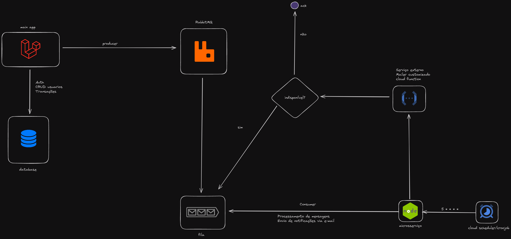

# README #

Desafio Backend

# Visão geral da solução



## Variáveis de Ambiente
Para rodar esse projeto, você vai precisar adicionar as seguintes variáveis de ambiente nos arquivos .env das aplicações.

Veja as variáveis abaixo e confira mais detalhes na seção "Rodando o projeto"

### Laravel
`RABBITMQ_HOST`

`RABBITMQ_PORT`

`RABBITMQ_USER`

`RABBITMQ_PASSWORD`

`RABBITMQ_VHOST`

### Microservice NodeJS (NestJS)
`RABBITMQ_URL`

`RABBITMQ_QUEUE`

`MAILER_SERVICE_URL`  


## Rodando o projeto (Necessário Docker instalado na máquina)

```bash
# Clone o projeto
$ git clone git@github.com:arraysArrais/desafio-backend.git

# Navegue até a pasta do projeto
$ cd desafio-backend

# Utilize os arquivos de variáveis de ambiente deixados como exemplo:

# PHP (Laravel)

$ cd application
$ mv .env.example .env # Linux
# Ou..
$ ren .env.example .env # Windows

# NodeJS (NestJS)

$ cd ../../notification-service
$ mv .env.example .env # Linux
# Ou..
$ ren .env.example .env # Windows

# Preencha os arquivos .env com as credenciais de acesso aos sistemas externos 
# fornecidas ao recrutador

# Copie o arquivo key.json para a pasta notification-service. 
# Este passo é necessário para realizar autenticação com o serviço externo 
# de envio de e-mails hospedado no Google Cloud em uma Cloud function.

# Agora já temos todas as credenciais necessárias para acesso aos serviços externos

# Navegue até a pasta raíz do repositório e inicie o container
$ docker compose up --build

# Após subir os serviços do container, vamos iniciar o setup da aplicação PHP.
# Abra um novo terminal, navegue até a raíz do repositório e execute o comando abaixo, 
# para executar comandos dentro do container da aplicação PHP.
$ docker compose exec php sh

# Agora execute os comandos a seguir:
$ composer install
$ php artisan key:generate
$ php artisan jwt:secret
$ php artisan migrate --force
$ php artisan db:seed
```

## Documentação
```bash
# Acesse o endereço abaixo no seu browser para acessar a SwaggerUI 
# e interagir com os recursos da API principal.

localhost:8080/api/documentation
```


